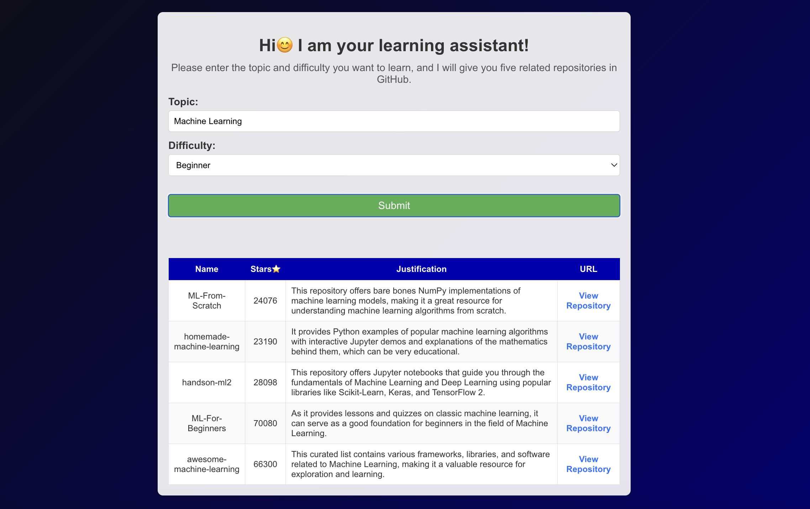

# Learning Assistant Project
## Overview
The Learning Assistant Project leverages Large Language Models (LLMs), the GitHub API, and the OpenAI API to intelligently recommend GitHub repositories based on the user's learning requirements. This tool analyzes repository data, categorizes it by difficulty level, and provides personalized recommendations to make learning more efficient and targeted.



## Objectives
GitHub is a hub for outstanding projects from developers worldwide. However, finding suitable resources for individual learning needs among the vast amount of repositories can be challenging.
Finding relevant resources for learning among a vast number of GitHub repositories can be daunting. The goal of this project is to streamline this process by:
1. Analyzing GitHub repositories using the GitHub API and OpenAI API.
2. Recommending repositories tailored to the user's learning preferences and difficulty levels.
3. Saving and reusing data to optimize API calls and improve performance.

## Technologies and Frameworks
* **Backend**:
    * Python: Programming language for backend implementation.
    * Flask: Web framework used for building the backend API.
    * GitHub API: To fetch repository data.
    * OpenAI API: To analyze repository difficulty levels and provide insights.
    * MongoDB: NoSQL database for storing API responses and reducing redundant requests.
* **Frontend**:
    * React: Framework used for building the interactive frontend.
    * CSS: Styling language for designing the user interface.

## Key Features
1. GitHub Repository Analysis:
    Retrieves and analyzes GitHub repositories for their difficulty levels, topics, and related metadata using the GitHub API and OpenAI API.

2. Personalized Recommendations:
    Provides repository recommendations based on the user’s learning preferences, adjusting difficulty levels to match the user's experience.

3. Data Optimization:
    Stores API responses in MongoDB to avoid repeated API calls within a two-week period.

4. Frontend Display:
    Displays repository data in a table, categorized by difficulty levels for easy navigation.

## How to Build and Run
#### Prerequisites
1. API Keys:
* Before using the GitHub API and OpenAI API, you need to obtain the required API keys and store them in the `.env` file. This ensures secure access to the APIs without exposing sensitive information in the codebase.
* You can obtain the following keys:
    * GitHub API Token: [GitHub API Token](https://github.com/settings/tokens)
    * OpenAI API Key: [OpenAI API Key](https://help.openai.com/en/articles/4936850-where-do-i-find-my-openai-api-key)
* Create a `.env` file in the root of your backend project and add the following content:
    ```bash
    GITHUB_TOKEN = your_github_token_here
    OPENAI_API_KEY = your_openai_api_key_here
    ```

2. MongoDB Setup:
To connect the application to MongoDB:  
* Create a Project and Cluster: Set up a project and cluster on [MongoDB Atlas](https://www.mongodb.com/cloud/atlas).  
* Create a User: Add a database user with a username and password for secure access.  
* Get your connection string and Update it in the code 

#### Backend Setup
1. Install dependencies:
    ```bash
    pip install -r requirements.txt
    ```

2. Start the Flask backend server:
    ```bash
    python app.py
    ```

#### Frontend Setup
1. Create a new React application:
    ```bash
    npx create-react-app learning-assistant
    ```

2. Install necessary frontend dependencies:
    ```bash
    npm install
    ```

3. Start the React development server:
    ```bash
    npm start
    ```

4. Access the application by navigating to http://localhost:3000 in your web browser.

## Results
1. The application successfully provides personalized repository recommendations by analyzing GitHub repository data with the OpenAI API.
2. MongoDB is used to store and retrieve GitHub and OpenAI API responses, minimizing redundant API calls and improving efficiency.
3. The frontend provides a clear and organized user interface to display repository recommendations.

## Conclusion
The Learning Assistant Project effectively leverages advanced AI models and GitHub data to recommend relevant repositories for learning. By optimizing API calls and presenting data in an intuitive manner, this project helps users discover resources suited to their learning needs, enhancing their learning experience.

## Future Work
1. User Authentication: Allow users to create accounts and track their learning progress.
2. Broader Repository Insights: Integrate additional metrics such as repository popularity, issues, and pull requests for a more comprehensive analysis.
3. Enhanced Difficulty Assessment: Implement a more refined algorithm to assess repository difficulty, perhaps using user reviews or community feedback.
4. Recommendation Personalization: Enable more granular customization of recommendations based on specific topics or learning goals.


